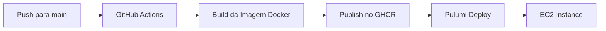

# Guia CI/CD - Hydra Game

## Visão Geral

Este projeto usa GitHub Actions + GitHub Container Registry + Pulumi para deploy automático na AWS.

## Fluxo Completo



## Configuração Inicial

### 1. Configurar GitHub Actions
- ✅ Arquivo `.github/workflows/build-and-deploy.yml` criado
- ✅ Permissões automáticas para GitHub Container Registry
- ✅ Build triggerado por push/PR na branch `main`

### 2. GitHub Container Registry
- **Registry**: `ghcr.io/mvilacad/hydra-game`
- **Tags**: `latest`, `sha-xxxxx`, branch names
- **Acesso**: Público (configurável)

### 3. Configuração Pulumi
```bash
cd pulumi/
pulumi config set repoName "mvilacad/hydra-game"
pulumi config set instanceType "t2.micro"  # ou maior
pulumi config set keyPairName "minha-key"  # opcional
```

## Como Usar

### Para Colaboradores

1. **Fork** o repositório
2. **Clone** localmente:
   ```bash
   git clone https://github.com/SEU-USUARIO/hydra-game.git
   cd hydra-game
   ```

3. **Desenvolvimento local**:
   ```bash
   pnpm dev              # Desenvolvimento
   # ou
   docker-compose up     # Com Docker
   ```

4. **Teste suas mudanças**:
   ```bash
   pnpm check            # TypeScript
   pnpm build            # Build de produção
   ```

5. **Pull Request**: 
   - PR para `main` triggera build automático
   - Imagem é buildada mas não publicada (apenas em PRs)
   - Merge publica imagem automaticamente

### Para Deploy

1. **Automático**: Push para `main` → Build → Deploy disponível

2. **Manual com Pulumi**:
   ```bash
   cd pulumi/
   pulumi up
   ```

3. **Atualização em instância existente**:
   ```bash
   # Na instância EC2
   cd /home/ec2-user/hydra-game
   ./update-app.sh
   ```

## Estrutura de Arquivos

```
.github/
├── workflows/
│   └── build-and-deploy.yml    # GitHub Actions workflow

docker-compose.prod.yml         # Usa imagem do registry
docker-compose.local.yml        # Build local
update-hydra-game.sh           # Script de atualização
debug-server.sh                # Debug e diagnóstico

pulumi/
├── index.ts                   # Configuração AWS (usa imagem do registry)
├── Pulumi.yaml
└── package.json
```

## Vantagens da Nova Arquitetura

### ✅ Antes (Problemas)
- Clone do repositório na EC2
- Build na instância (lento, consome recursos)
- Dependência de conectividade Git na instância
- Builds inconsistentes entre ambientes

### ✅ Agora (Melhorado)
- Build padronizado no GitHub Actions
- Imagem pré-buildada e testada
- Deploy rápido (apenas pull da imagem)
- Mesma imagem em todos os ambientes
- Fácil rollback e atualizações

## Troubleshooting

### Build falhando no GitHub Actions
```bash
# Verificar logs no GitHub:
# https://github.com/mvilacad/hydra-game/actions

# Testar build localmente:
docker build -t hydra-game .
```

### Imagem não disponível no registry
```bash
# Verificar se o workflow executou:
gh run list --repo mvilacad/hydra-game

# Testar pull manual:
docker pull ghcr.io/mvilacad/hydra-game:latest
```

### Deploy Pulumi com problemas
```bash
# Debug da instância:
pulumi logs
pulumi stack output

# SSH na instância (se configurado):
ssh -i ~/.ssh/minha-key.pem ec2-user@IP-DA-INSTANCIA
```

### Aplicação não iniciando
```bash
# Na instância EC2 ou local:
./debug-server.sh

# Verificar logs:
docker-compose logs -f app
```

## Próximos Passos

1. **Monitoramento**: Adicionar health checks
2. **Staging**: Environment de homologação
3. **Database**: Migração para PostgreSQL em produção
4. **SSL**: Certificados HTTPS automáticos
5. **CDN**: CloudFront para assets estáticos

## Contato

Para dúvidas sobre o processo CI/CD, abra uma issue no repositório ou contate o time de DevOps.